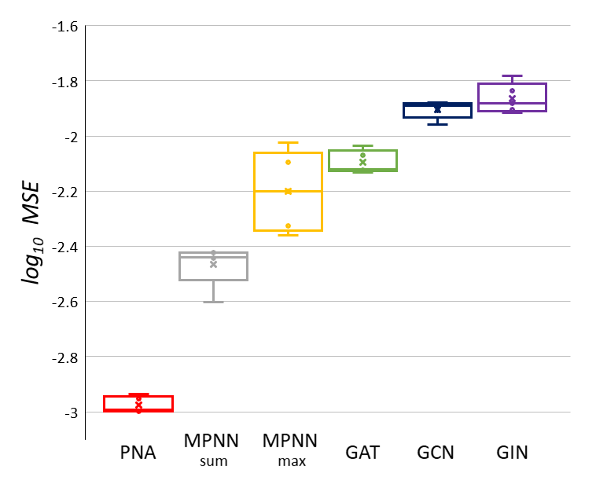

# Multi-task benchmark



## Overview

We provide the scripts for the generation and execution of the multi-task benchmark.
- `dataset_generation` contains:
  - `graph_generation.py` with scripts to generate the various graphs and add randomness;
  - `graph_algorithms.py` with the implementation of many algorithms on graphs that can be used as labels;
  - `multitask_dataset.py` unifies the two files above generating and saving the benchmarks we used in the paper.
- `util` contains:
  - preprocessing subroutines and loss functions (`util.py`);
  - general training and evaluation procedures (`train.py`).
- `train` contains a script for each model which sets up the command line parameters and initiates the training procedure. 
  
This benchmark uses the PyTorch version of PNA (`../models/pytorch/pna`)

## Dependencies
Install PyTorch from the [official website](https://pytorch.org/). The code was tested over PyTorch 1.4.

Then install the other dependencies:
```
pip3 install -r multitask_benchmark/requirements.txt
```

## Test run

Move to the source of the repository before running the following.

Generate the benchmark dataset (add `--extrapolation` for multiple test sets of different sizes):
```
python3 -m multitask_benchmark.datasets_generation.multitask_dataset
```

then run the training:
```
python3 -m multitask_benchmark.train.pna --variable --fixed --gru --lr=0.003 --weight_decay=1e-6 --dropout=0.0 --epochs=10000 --patience=1000 --variable_conv_layers=N/2 --fc_layers=3 --hidden=16 --towers=4 --aggregators="mean max min std" --scalers="identity amplification attenuation" --data=multitask_benchmark/data/multitask_dataset.pkl
```

The command above uses the hyperparameters tuned for the non-extrapolating dataset and the architecture outlined in the diagram below. For more details on the architecture, how the hyperparameters were tuned and the results collected refer to our [paper](https://arxiv.org/abs/2004.05718).

